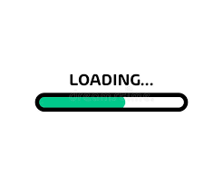

# Project webpage that includes an HTML or CSS topic. 

## This webpage shows how to build a simple loading bar with HTML and CSS.

## Table of Contents
   *  [LICENSE](#license)
   *  [README.md](#readmemd)
   *  [Project Structure](#project-structure)
   *  [gitignore](#.gitignore)

## General Information
   *  This repository was created as a project to use **HTML5**, and/or **CSS3** to convey understanding of syntax structure and functionality. 
   * The README.md utilized the Markdown language syntax
   * VS Code utilized as 'best practice' trifecta of Bash (Git), GitHub and VS Code.
   * Added a tab favicon loading bar image for webpage
   * 
  
     
## Technologies
Project Structure:

   *  `index.html` - Main structure
   *  `style.css`    - Stylesheets
   *  `.gitignore` - Version control exclusions
   *  `README.md`  - Project outline
   *  `License`
